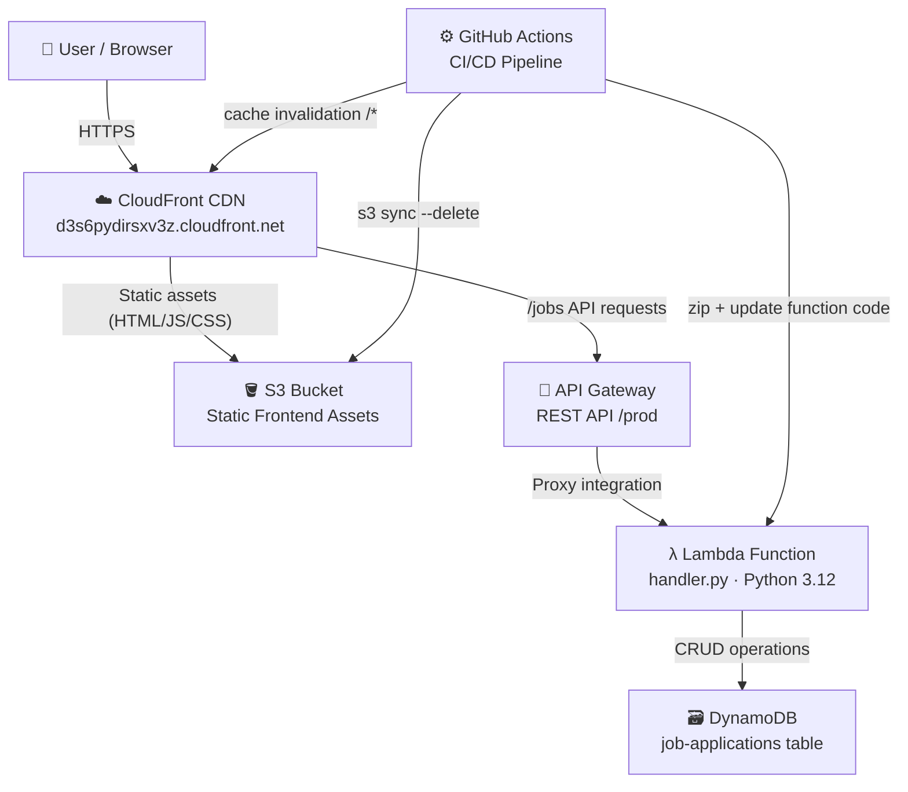

# Serverless Job Tracker

> A fully serverless job application tracker built on AWS — track every application from first click to offer letter.

[](https://aws.amazon.com/)
[](https://www.terraform.io/)
[](https://react.dev/)
[](https://github.com/features/actions)

---

## Features

- **Track applications end-to-end** — company, role, status, date applied, job URL, and notes
- **6 status stages** — Applied, Phone Screen, Interviewing, Offer Received, Rejected, Withdrawn
- **Sortable table** — sort by any column to prioritize your pipeline
- **Full CRUD** — add, edit, and delete applications with instant feedback
- **Confirmation dialogs** — prevents accidental deletes
- **Responsive UI** — clean Material-UI design with custom Apple-inspired theme
- **Zero servers** — fully managed, pay-per-use AWS infrastructure

---

## Tech Stack

| Layer | Technology |
|---|---|
| Frontend | React 19, Vite 7, Material-UI 7 |
| Backend | AWS Lambda (Python 3.12) |
| API | AWS API Gateway (REST, regional) |
| Database | AWS DynamoDB (pay-per-request) |
| CDN / Hosting | AWS CloudFront + S3 |
| Infrastructure | Terraform |
| CI/CD | GitHub Actions |

---

## Infrastructure Diagram



### How it works

1. **CloudFront** serves as the single entry point — static assets come from S3, API requests are proxied to API Gateway.
2. **API Gateway** routes `GET/POST/PUT/DELETE /jobs` to the Lambda function.
3. **Lambda** (`handler.py`) handles all CRUD logic and reads/writes to DynamoDB.
4. **DynamoDB** stores job applications with `applicationId` (UUID) as the primary key.
5. **GitHub Actions** builds the React app, syncs it to S3, updates the Lambda zip, and invalidates the CloudFront cache — all on every push to `main`.

---

## Getting Started (Local Development)

### Prerequisites

- Node.js 24+
- Python 3.12+
- Terraform 1.2+
- AWS CLI configured with a profile named `personal`

### Run the frontend locally

```bash
cd frontend
npm install
npm run dev
```

The app will start at `http://localhost:5173`. It points to the deployed API Gateway endpoint by default — update `src/services/api.js` if you want to point to a local backend.

---

## Deployment

### 1. Provision infrastructure with Terraform

```bash
cd infra
terraform init
terraform apply
```

This creates the DynamoDB table, Lambda function, API Gateway, S3 bucket, and CloudFront distribution.

### 2. Set GitHub Actions secrets and variables

In your repository settings, add:

| Name | Type | Value |
|---|---|---|
| `AWS_ACCESS_KEY_ID` | Secret | Your AWS access key |
| `AWS_SECRET_ACCESS_KEY` | Secret | Your AWS secret key |
| `S3_BUCKET_NAME` | Variable | Output from `terraform output` |
| `CLOUDFRONT_DISTRIBUTION_ID` | Variable | Output from `terraform output` |

### 3. Push to `main` to deploy

```bash
git push origin main
```

GitHub Actions will build the frontend, deploy the Lambda, sync assets to S3, and invalidate the CloudFront cache automatically.

---

## API Reference

| Method | Path | Description |
|---|---|---|
| `GET` | `/jobs` | List all job applications |
| `POST` | `/jobs` | Create a new application |
| `PUT` | `/jobs/{id}` | Update an existing application |
| `DELETE` | `/jobs/{id}` | Delete an application |

### Job application schema

---

## Project Structure

```
severless-job-tracker/
├── .github/
│   └── workflows/
│       └── deploy.yml          # CI/CD pipeline
├── frontend/
│   ├── src/
│   │   ├── components/         # React UI components
│   │   │   ├── Header.jsx
│   │   │   ├── JobTable.jsx
│   │   │   ├── JobFormModal.jsx
│   │   │   ├── StatusChip.jsx
│   │   │   └── EmptyState.jsx
│   │   ├── services/
│   │   │   └── api.js          # API Gateway client
│   │   ├── App.jsx             # Root component & state
│   │   └── theme.js            # Material-UI custom theme
│   ├── package.json
│   └── vite.config.js
├── lambda/
│   └── handler.py              # Lambda CRUD handler (Python 3.12)
├── infra/
│   ├── main.tf                 # AWS resource definitions
│   ├── variables.tf
│   ├── outputs.tf
│   └── terraform.tf            # Provider config
└── README.md
```

---

## License

MIT — use it, fork it, track your jobs with it.
